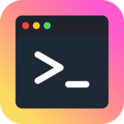

<div align="center">
  <a href="https://www.macos-post-install.dev/">
    
  </a>
  <h1>macOS Post-Install</h1>

<p>
  <a href="https://nextjs.org/"></a>
  <a href="https://tailwindcss.com/"></a>
  <a href="https://www.conventionalcommits.org/"></a>
  <a href="https://opensource.org/license/mit/"></a>
</p>

</div>

## Introduction

macOS Post-Install Script Generator is an open-source tool to automate macOS setup.
You select your apps, generate a script, run it once, and your Mac installs everything automatically using Homebrew. Perfect after a fresh macOS install or for onboarding new machines.

It’s a macOS adaptation of [Kaic’s Windows Post-Install](https://kaic.me/win-post-install/) project, bringing the same idea to macOS ecosystem.

The project is fully open source, so feel free to share feedback, ideas, or contribute!

## Demo

1. Open https://www.macos-post-install.dev
2. Choose the applications you want to install on your Mac
3. Get a ready-to-use script tailored to your selections
4. Execute the script in your terminal to install the apps

Your Mac is now ready to use!

## Local development

### System requirements

Before you begin, make sure your development environment meets the following requirements:

- Node.js: 20.9 or higher
- Operating systems: macOS, Windows (including WSL), and Linux

### Installation

```bash
git clone https://github.com/orpheebesson/macos-post-install.git
cd macos-post-install
npm install
```

### Run the development server

1. Run `npm run dev` to start the development server
2. Visit `http://localhost:3000` to view your application

### Build the app

```bash
npm run build
```

## Project structure

```
macos-post-install/
├── .github/
│   └── ISSUE_TEMPLATE/      # Issue templates
├── app/
│   ├── components/          # Components
│   │   ├── atoms/           # Smallest, indivisible UI elements (buttons, inputs, icons, text, etc.)
│   │   ├── moles/           # Simple combinations of atoms forming a single, focused component
│   │   └── organisms/       # Complex components composed of multiple molecules and atoms
│   ├── context/             # Context providers
│   ├── data/
│   │   ├── apps.ts          # App definitions
│   │   └── categories.ts    # Category definitions
│   ├── hooks/               # Custom hooks
│   ├── types/               # Type definitions
│   └── utils/               # Utility functions
└── public/                  # Static assets
```

## Contributing

Contributions to macOS Post-Install are welcome and highly appreciated. However, before you jump right into it, we would like you to review our [Contribution Guidelines](https://github.com/orpheebesson/macos-post-install/blob/main/CONTRIBUTING.md) to make sure you have a smooth experience contributing to macOS Post-Install.

## License

[MIT](https://github.com/orpheebesson/macos-post-install/blob/main/LICENSE)

## Resources

- [Next.js](https://nextjs.org/)
- [Tailwind CSS](https://tailwindcss.com/)
- [React Icons](https://react-icons.github.io/react-icons/)
- [Homebrew](https://brew.sh/)

## Credits

- [React Icons](https://react-icons.github.io/react-icons/)
- [Kaic](https://kaic.me/) and his [Win-Post-Install](https://kaic.me/win-post-install/) project that inspired me
